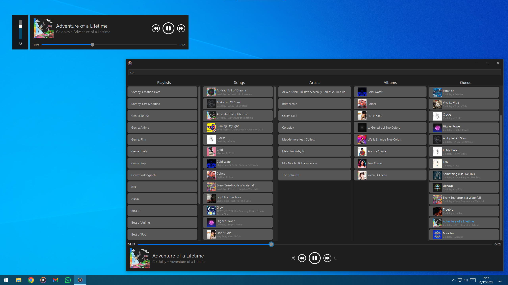

# Music Player
Since Microsoft made its Groove a non-working crap I decided to create my own music player

⚠ Double click the Stop button on your keyboard to toggle the main window visibility

## Limitations
- Requires Java
- Only works with MP3 songs
- Only works with ZPL playlists (the ones created by Groove)
